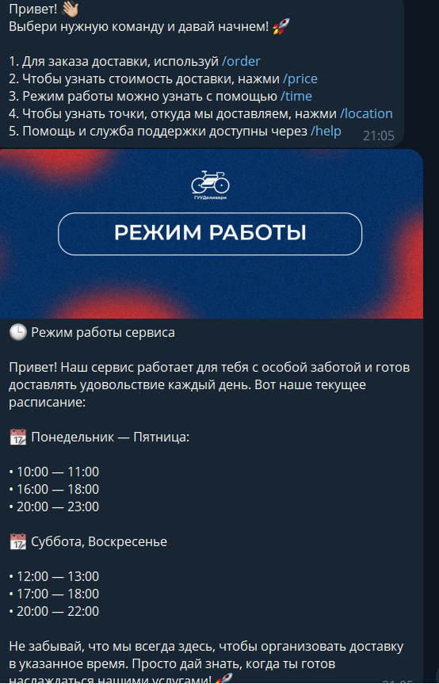
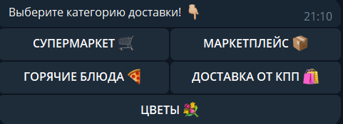
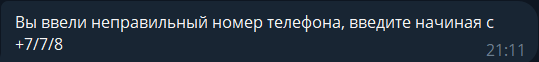
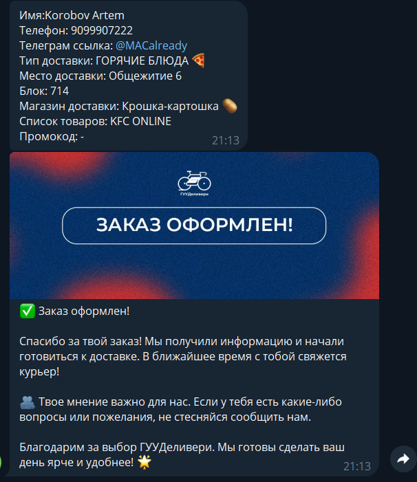

# DeliveryBot

TG-Бот для оформление заказов внутри студенческого сообщества общежитий

Для пользователя позволяет сделать полноценный заказ в рамках доставки района, а для курьера позволяет увидеть приходящие заказы и держать связь с заказчиком

Работа основана на выводе основной информации и обработки оформления заказа через машину состояния 

# Запуск бота

Существует 2 возможности запуска бота: с веб-хуком и без.

Для этого нужно запустить соответствующий файл: Bot_main.py для веб-хука (необходимо создать переменную окружения с ссылкой на NGROK ссылку), или Bot_main_without_webhook.py, тогда можно удалить NGROK переменную в id_bot.py

Чтобы  подключить API запросы к своему боту необходимо подставить токен своего бота в id в файле id_bot.py

# Личная кастомизация

Для изменения текста можно воспользоваться файлом по пути core/text.py, где описаны переменные c тектом, которые хендлеры выдают на запросы бота

Для изменения адерса оповещения о новом заказе надо поменять bot.send_message в последней функции файла routers_bot/order_bot.py

Для кастомизации данных в боте(наличие магазинов доставки и т.д.) можно поменять команду создания базы данных в core/cursor.py или внести новые данные в core/waves.db(По умолчанию они заполнены)

Так же добавлена простая валидация телефона

# Оповещение заказа

Для оповещения заказа надо поменять chat_id в bot.send_message > number_order > order_router.py

Заказ приходит в виде описания всех полей и ответов на них пользователя

